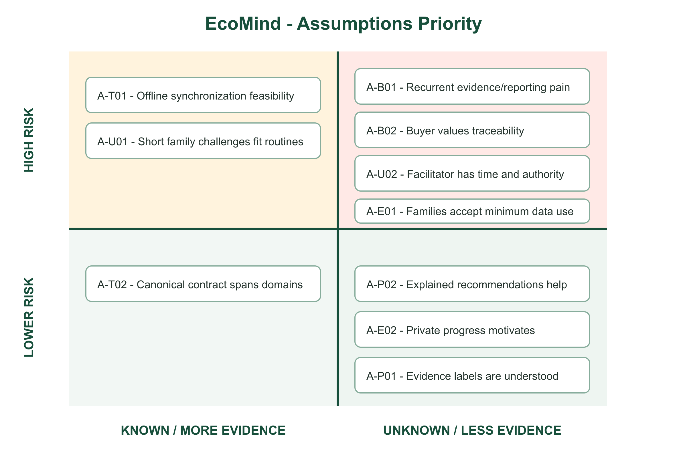
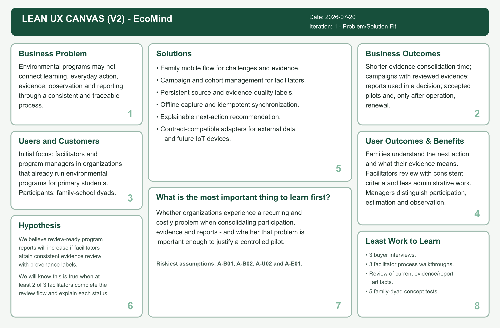

## Solution Profile

### Antecedentes y problemática

#### Antecedente del producto

EcoMind nació como una propuesta estudiantil de educación ambiental gamificada para escolares y familias, con retos sobre reciclaje, ahorro de agua, eficiencia energética y cuidado del entorno. Green Minds conserva ese propósito y lo reconstruye desde cero como una solución móvil multidominio. El antecedente se usa para reconocer decisiones previas y preguntas de investigación, pero no como evidencia de eficacia ni como fuente automática de código, activos o entrevistas para el nuevo proyecto.

El ecosistema peruano no parte de la ausencia de educación ambiental. El Ministerio de Educación reporta que 54 359 instituciones de educación básica comunicaron logros ambientales durante 2025 y que se conformaron 58 376 brigadas de educación ambiental y gestión del riesgo [@mineduEducacionAmbiental2026]. Asimismo, el Ministerio del Ambiente ofrece recursos mediante Aula Ambiental y coordina programas como EDUCCA y Eco Aventuras [@minamEscolares2025; @minamEcoAventuras2026]. Estas cifras muestran actividad institucional y una población potencial amplia; por sí solas no demuestran continuidad del comportamiento, calidad de evidencia ni demanda de un SaaS.

La literatura reciente sí aporta antecedentes para investigar la conexión entre educación, comportamiento y medición. En una intervención realizada en 25 escuelas europeas, Mylonas et al. combinaron infraestructura IoT, actividades educativas, monitoreo y gamificación; los resultados publicados fueron favorables para ahorro energético de corto plazo y conciencia declarada, aunque corresponden al dominio energético y a un contexto distinto del peruano [@mylonas2025iot]. Por otra parte, un experimento aleatorizado en China encontró que una intervención con estudiantes redujo el consumo eléctrico del hogar, pero que los intentos de los estudiantes por influir en sus padres no produjeron un cambio parental significativo [@wang2025power]. Este segundo resultado es especialmente importante: la transferencia entre escuela y hogar no debe asumirse.

#### Formulación del problema

Los programas de educación ambiental dirigidos a escolares y familias pueden ejecutar contenidos, campañas y actividades, pero sus participantes, facilitadores y responsables organizacionales necesitan sostener el paso desde el aprendizaje hasta la acción cotidiana y comprender qué evidencia respalda cada resultado. La oportunidad de EcoMind se formula como una hipótesis de problema: las actividades, evidencias y observaciones se gestionan en momentos o medios separados y con grados de confiabilidad que no siempre son comparables. Las entrevistas deberán confirmar, refutar o acotar esta formulación.

**Síntesis preliminar del problema.** Las organizaciones que desarrollan educación ambiental con escolares y sus familias necesitan acompañar y evaluar el paso desde el aprendizaje hasta la acción cotidiana, porque las actividades, evidencias y resultados se encuentran potencialmente dispersos y poseen niveles de confiabilidad distintos que dificultan ofrecer retroalimentación y decidir cómo mejorar el programa.

Esta formulación evita afirmar que una tecnología resolverá por sí sola el comportamiento ambiental. También evita tratar como sinónimos la participación, el aprendizaje, la ejecución de una actividad y el impacto físico.

#### Análisis 5W2H

| Dimensión | Análisis inicial | Estado de evidencia |
|---|---|---|
| **What - ¿qué ocurre?** | El ciclo entre contenido ambiental, acción, evidencia, observación, retroalimentación y evaluación del programa no dispone aún de una representación común validada para los actores objetivo de EcoMind. | Hipótesis de problema por validar. |
| **Who - ¿a quién afecta?** | A familias con escolares de 9 a 12 años, facilitadores educativos o ambientales y responsables de organizaciones que necesitan acompañar o evaluar programas. | Segmentos provisionales sustentados en el modelo B2B2C; requieren entrevistas. |
| **Where - ¿dónde ocurre?** | En la transición entre escuela, hogar y actividad comunitaria, tanto en sesiones presenciales como en medios digitales y contextos de conectividad intermitente. | El contexto de conectividad se sustenta con datos oficiales; la fragmentación requiere Needfinding. |
| **When - ¿cuándo se manifiesta?** | Al asignar una actividad, realizarla fuera del aula, registrar evidencia, revisarla, interpretar un indicador o preparar un informe de campaña. | Hipótesis de proceso por observar. |
| **Why - ¿por qué podría ocurrir?** | Porque contenido, coordinación, evidencia y medición pueden estar distribuidos entre documentos, mensajería, formularios y sistemas con semánticas distintas; además, una acción autodeclarada no equivale a una observación física. | Causas candidatas; no se consideran demostradas antes de las entrevistas y observación contextual. |
| **How - ¿cómo se maneja hoy?** | Mediante recursos educativos, campañas, brigadas y reportes institucionales. El proceso exacto, sus herramientas y sus puntos de dolor deben mapearse por segmento. | La existencia de programas está confirmada; el flujo operativo está pendiente. |
| **How much - ¿qué magnitud tiene?** | El Censo Educativo 2025 registró 3 666 690 matrículas de primaria: 2 712 124 en gestión pública y 954 566 en gestión privada [@mineduCenso2025]. En 2025, 54 359 instituciones de educación básica reportaron logros ambientales [@mineduEducacionAmbiental2026]. Estas cifras dimensionan el universo educativo, no la demanda ni el impacto de EcoMind. | Datos oficiales; mercado obtenible y necesidad de compra aún no validados. |

#### Objetivos iniciales de la solución

- Permitir que una familia comprenda y complete acciones ambientales sobre agua, energía, residuos, consumo responsable, movilidad y entorno sin confundir ejecución con impacto medido.
- Permitir que un facilitador asigne campañas, acompañe participantes y revise evidencia con criterios visibles.
- Permitir que una organización analice participación, procedencia y calidad de evidencia antes de comunicar resultados.
- Conservar un contrato multidominio que acepte entradas manuales, fotografías, documentos, servicios externos, datos simulados y, posteriormente, dispositivos IoT.
- Recomendar una siguiente acción de manera explicable, apropiada para el contexto y sujeta a confirmación humana cuando intervenga IA.

#### Restricciones y riesgos

1. **Conectividad.** En el primer trimestre de 2025, el 95,2 % de los hogares peruanos tenía telefonía móvil, pero solo el 58,9 % disponía de Internet; en el área rural, la telefonía móvil alcanzaba 86,6 % [@ineiTic2025]. EcoMind debe soportar almacenamiento local, trabajo offline y sincronización diferida, sin prometer cobertura universal.
2. **Menores y datos personales.** El tratamiento de cuentas, fotografías, ubicación y evidencia exige minimización, información comprensible, consentimiento válido, retención limitada y mecanismos de ejercicio de derechos según el Reglamento de la Ley N.° 29733 [@peruDatos2024].
3. **IA.** El Reglamento peruano de la Ley N.° 31814 exige evaluar el riesgo, mantener transparencia y supervisión humana [@pcmIa2026]. EcoMind no utilizará IA para puntuar opacamente a menores ni presentará una inferencia como verdad.
4. **Validez.** Un prototipo móvil y los fixtures de CC238 solo permiten validar tareas, comprensión y factibilidad técnica; no demuestran ahorro de recursos ni cambio conductual longitudinal.
5. **Alcance.** Las aplicaciones Swift, Kotlin y Flutter deben conservar las mismas tareas esenciales y el mismo contrato, aun cuando el incremento de implementación se entregue por etapas.
6. **Propiedad intelectual.** No se copiarán código, textos, imágenes o personajes del antecedente si no existe permiso o licencia verificable.

### Lean UX Process

#### Lean UX Problem Statements

El Problem Statement se organiza mediante dominio, customer segments, pain points, gap, visión o estrategia e initial segment. Estos elementos delimitan una sola problemática y no atribuyen una causa todavía no demostrada.

| Elemento | Formulación de trabajo |
|---|---|
| **Domain** | Gestión de programas de educación y acción ambiental que conectan escuela, hogar y comunidad. |
| **Customer segments** | Díadas familia-escolar, facilitadores educativos o ambientales y responsables de organizaciones o programas. |
| **Pain points** | Instrucciones, ejecución, evidencia, revisión y reporte pueden ocurrir en herramientas o momentos separados; los actores no necesariamente interpretan de la misma forma la fuerza de una evidencia. |
| **Gap** | No se ha identificado todavía un proceso común, validado y trazable que permita acompañar la acción y distinguir participación, estimación y observación. |
| **Vision / strategy** | Investigar primero el proceso y la evidencia; luego validar una experiencia móvil multidominio y, solo después, incorporar fuentes externas, IoT e IA con procedencia visible. |
| **Initial segment** | Organizaciones de Lima Metropolitana que ya ejecutan programas ambientales con escolares de primaria y cuentan con un facilitador y un responsable capaz de aprobar un piloto. Esta selección es una assumption, no un mercado confirmado. |

**Objetivo actual.** Las organizaciones buscan que las actividades ambientales sean comprendidas, ejecutadas, acompañadas y reportadas de forma útil para sus participantes y responsables.

**Problema observado de manera preliminar.** Las actividades, evidencias y resultados pueden quedar dispersos y poseer niveles de confiabilidad que no son comparables, lo que dificulta la retroalimentación y la evaluación del programa.

**Solicitud explícita de mejora.** ¿Cómo podríamos mejorar la continuidad y evaluación de las actividades ambientales entre organización, facilitador y familia, sin asumir que la ejecución declarada equivale a impacto medido?

Este Problem Statement permanecerá provisional hasta contrastarlo con entrevistas y artefactos actuales. No se conoce todavía qué actor experimenta el mayor dolor, qué evidencia considera suficiente, quién controla el presupuesto ni qué resultado genera renovación.

#### Lean UX Assumptions

##### Assumptions Worksheet - comprensión del uso

| Pregunta | Respuesta provisional de Green Minds |
|---|---|
| **1. ¿Quién es el usuario?** | Escolares de 9 a 12 años y sus tutores como díada participante; facilitadores que acompañan y revisan; responsables que administran o financian programas. |
| **2. ¿Dónde encaja el producto en su trabajo o vida?** | En campañas escolares, familiares o comunitarias: antes de la acción para orientar, durante la ejecución para registrar y después para revisar, retroalimentar y reportar. |
| **3. ¿Qué problema debe resolver el producto?** | La falta potencial de continuidad y trazabilidad entre actividad, evidencia, observación y decisión del programa. La existencia y prioridad del problema aún deben validarse. |
| **4. ¿Cuándo y cómo se usaría?** | En sesiones breves dentro o fuera del aula, con teléfono compartido o propio, conectividad variable y un panel organizacional utilizado en planificación y revisión. |
| **5. ¿Qué características son importantes?** | Retos multidominio, responsabilidades claras, evidencia con fuente/calidad, revisión, modo offline, sincronización, privacidad, accesibilidad e informes trazables. |
| **6. ¿Cómo debe verse y comportarse?** | Debe ser comprensible para la edad, sobrio para el adulto y eficiente para el facilitador; debe mostrar estados, errores, procedencia y simulación sin ambigüedad. |

##### Assumptions Worksheet - modelo de negocio

| N.° | Declaración base | Assumption de Green Minds |
|---:|---|---|
| 1 | Creo que mis clientes necesitan... | coordinar actividades ambientales y consolidar evidencia e informes con menor ambigüedad. |
| 2 | Estas necesidades se pueden resolver con... | un ciclo compartido de campaña, acción, evidencia, revisión, observación y reporte. |
| 3 | Mis clientes iniciales son o serán... | organizaciones de Lima Metropolitana que ya ejecutan programas ambientales para primaria. |
| 4 | El valor número uno que un cliente quiere... | comprender qué ocurrió y qué fuerza tiene la evidencia antes de comunicar resultados. |
| 5 | El cliente también puede obtener... | acompañamiento, participación, menor esfuerzo de consolidación, funcionamiento offline y controles de privacidad. |
| 6 | Adquiriremos la mayoría de clientes mediante... | alianzas y pilotos con colegios, municipalidades, ONG o programas de sostenibilidad; el canal exacto está por validar. |
| 7 | Generaremos ingresos mediante... | suscripción por programa activo y capacidades opcionales de analítica o Connected Lab; precio y unidad económica están por validar. |
| 8 | Nuestra competencia principal será... | JouleBug como SaaS de participación, GLOBE Observer como referente científico y las alternativas públicas de Minam. |
| 9 | Competiremos debido a... | pertinencia peruana, experiencia familiar protegida y trazabilidad entre evidencia móvil, fuentes externas e IoT. |
| 10 | Nuestro mayor riesgo de producto es... | que el problema de consolidación no sea recurrente o no justifique adoptar otra plataforma. |
| 11 | Abordaremos ese riesgo mediante... | entrevistas de proceso, revisión de artefactos y un piloto con criterios de continuidad definidos antes de construir analítica avanzada. |
| 12 | Otra assumption que podría invalidar el proyecto es... | que familias o facilitadores no acepten la carga, el tratamiento mínimo de datos o la distribución de responsabilidades. |

##### Registro y priorización

Las assumptions se priorizan por riesgo y desconocimiento. `Alta` significa que, si resulta falsa, debe cambiar el alcance, el segmento inicial o el modelo de negocio.

| ID | Tipo | Assumption | Riesgo | Método de validación |
|---|---|---|---|---|
| A-B01 | Negocio | Una organización que ya ejecuta un programa ambiental tiene un problema recurrente al consolidar participación, evidencia e informes. | Alta | Entrevistas de proceso y revisión de artefactos actuales con responsables. |
| A-B02 | Negocio | El comprador valorará más trazabilidad y gestión de campañas que una biblioteca adicional de contenido. | Alta | Ranking de problemas, comparación de propuestas y solicitud de siguiente paso de piloto. |
| A-U01 | Usuario | La unidad familiar adulto-escolar puede incorporar retos breves en su rutina sin generar una carga desproporcionada. | Alta | Entrevista contextual y prueba de recorrido con cinco díadas. |
| A-U02 | Usuario | Un facilitador dispone de tiempo y autoridad para asignar, acompañar y revisar evidencia. | Alta | Entrevistas con docentes/coordinadores y mapa de responsabilidades. |
| A-P01 | Producto | Las etiquetas de fuente y calidad permiten distinguir dato declarado, simulado, observado e inferido. | Alta | Prueba de comprensión con ejemplos equivalentes. |
| A-P02 | Producto | Una recomendación multidominio explicada resulta más útil que una lista genérica de consejos. | Media | Prueba comparativa de prototipo y entrevista posterior a la tarea. |
| A-T01 | Técnica | Un modelo offline-first puede conservar evidencia y sincronizarla sin duplicados cuando vuelve la conexión. | Alta | Spike técnico con desconexión, reintento e idempotencia. |
| A-T02 | Técnica | El contrato de observación ambiental puede representar los seis dominios sin filtrar detalles de sensores o proveedores hacia la experiencia móvil. | Media | Fixtures, revisión de dominio y pruebas de contrato. |
| A-E01 | Ética | Las familias aceptarán el tratamiento mínimo de evidencia si comprenden propósito, retención y controles. | Alta | Entrevista de confianza; no se recopilarán imágenes reales antes del consentimiento. |
| A-E02 | Ética | El progreso privado por familia/equipo motiva sin requerir un ranking público infantil. | Media | Prueba de preferencia y observación de motivadores. |

**Figura 1**

*Assumptions Priority de EcoMind según riesgo y nivel de conocimiento actual.*

*Nota.* Elaboración propia. La matriz utiliza los ejes `Known / Unknown` y `High Risk / Low Risk`. Los cuadrantes expresan el conocimiento disponible al 20 de julio de 2026 y deben actualizarse después de Needfinding. Fuente editable: [`assumptions-priority.svg`](../../assets/figures/lean-ux/assumptions-priority.svg).

#### Lean UX Hypothesis Statements

Las hypotheses siguen la estructura: “Creemos que [hacer esto] para [estas personas] logrará [este outcome]. Sabremos que es cierto cuando observemos [feedback o cambio medible]”. Cada hypothesis conserva segmento, cambio, outcome y señal. Los umbrales son criterios provisionales de decisión, no resultados obtenidos.

| ID | Hypothesis Statement | Decisión si falla |
|---|---|---|
| H-F01 | **Creemos que** ofrecer un recorrido con responsabilidades diferenciadas para díadas adulto-escolar permitirá completar una acción con evidencia comprensible. **Sabremos que es cierto cuando** al menos 4 de 5 díadas terminen `perfil → reto → evidencia → progreso` en 10 minutos o menos, sin ayuda crítica, y expliquen quién confirma la evidencia. | Simplificar responsabilidades y revisar si adulto y escolar deben operar en momentos distintos. |
| H-E01 | **Creemos que** mostrar fuente, calidad y explicación a familias y facilitadores permitirá interpretar correctamente la fuerza de una evidencia. **Sabremos que es cierto cuando** al menos 80 % de las respuestas clasifique correctamente cinco ejemplos y nadie presente un dato simulado como medido. | Rediseñar vocabulario, jerarquía visual y progreso antes de añadir IA o IoT. |
| H-F02 | **Creemos que** ofrecer plantillas de campaña a facilitadores reducirá el esfuerzo de asignación y revisión. **Sabremos que es cierto cuando** al menos 2 de 3 facilitadores creen, asignen y revisen una campaña en 12 minutos o menos y expliquen correctamente cada estado. | Reducir configuración o revisar si la organización necesita otro rol operativo. |
| H-B01 | **Creemos que** ofrecer un informe con procedencia visible a responsables de programa aumentará la disposición a evaluar un piloto. **Sabremos que es cierto cuando** al menos 2 de 3 responsables describan un problema actual de consolidación o calidad y acuerden criterios concretos para un siguiente paso. | Cambiar cliente inicial o propuesta de valor; no construir analítica avanzada. |
| H-O01 | **Creemos que** permitir captura offline a participantes con conectividad intermitente evitará abandonar una actividad iniciada. **Sabremos que es cierto cuando** los escenarios de desconexión, reintento, duplicado y conflicto pasen las pruebas de aceptación sin pérdida silenciosa. | Reducir datos capturados offline o rediseñar el protocolo de sincronización. |

Una hipótesis longitudinal sobre cambio de comportamiento o impacto ambiental requerirá socio, periodo, baseline, tamaño muestral y protocolo. No se utilizará una prueba de usabilidad como sustituto de ese experimento.

#### Lean UX Canvas

La Figura 2 organiza el Lean UX Canvas V2 en ocho bloques. El canvas resume una iteración de Problem/Solution Fit; no afirma que las hypotheses ya estén validadas.

**Figura 2**

*Lean UX Canvas V2 de EcoMind, iteración 1.*

*Nota.* Elaboración propia a partir de Lean UX Canvas V2. Iteración 1, con fecha 20 de julio de 2026. Fuente editable: [`lean-ux-canvas-v2.svg`](../../assets/figures/lean-ux/lean-ux-canvas-v2.svg).

El aprendizaje prioritario es comprobar si la consolidación de participación, evidencia e informes constituye un problema recurrente y suficientemente importante para que una organización evalúe un piloto. El experimento mínimo combina entrevistas a tres responsables, walkthroughs con tres facilitadores, revisión de artefactos actuales y pruebas conceptuales con cinco díadas familiares.
