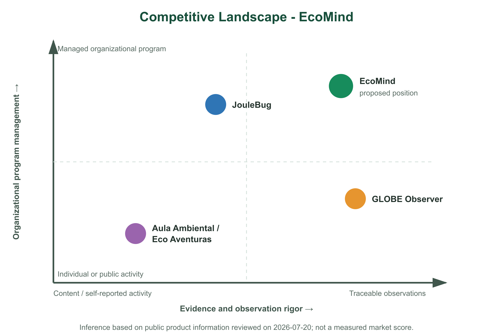

## Competidores

El análisis considera competidores directos e indirectos que cubren partes diferentes del problema. La revisión se realizó sobre información pública disponible al 20 de julio de 2026. Cuando una capacidad no aparece en la documentación consultada se registra como “no identificada”; no se interpreta automáticamente como inexistente.

### Panorama competitivo

**JouleBug.** Plataforma de sostenibilidad para organizaciones con participantes, comunidades, acciones, desafíos, notificaciones y un panel administrativo. Su documentación pública muestra desafíos que pueden durar desde una semana hasta un semestre y acciones relacionadas con agua, energía, residuos y transporte [@joulebugHelp2026; @joulebugChallenges2026]. Es el competidor más cercano al modelo SaaS de campañas y participación de EcoMind.

**GLOBE Observer.** Aplicación de ciencia ciudadana vinculada al GLOBE Program que guía observaciones ambientales y permite participar como individuo, familia, escuela o equipo. Declara presencia en más de 125 países y exige supervisión adulta para menores de 13 años [@globeObserver2026]. Es un referente para protocolos de observación y contribución científica, aunque su propósito no es administrar un programa SaaS de hábitos ambientales multidominio.

**Aula Ambiental y Eco Aventuras.** Alternativas públicas peruanas promovidas por el Ministerio del Ambiente. Aula Ambiental ofrece más de cien recursos entre publicaciones, videos, infografías, cuentos y juegos; Eco Aventuras 2026 organiza misiones, retos y actividades ambientales para niños y jóvenes [@minamEscolares2025; @minamEcoAventuras2026]. Constituyen una alternativa local gratuita de contenido y actividades, no una prueba de que el problema de seguimiento organizacional esté resuelto.

\newpage

**Figura 3**

*Competitive Landscape de EcoMind y las alternativas analizadas.*

*Nota.* Elaboración propia a partir de capacidades declaradas en las fuentes primarias revisadas [@joulebugHelp2026; @joulebugChallenges2026; @globeObserver2026; @minamEscolares2025; @minamEcoAventuras2026]. La posición es una inferencia cualitativa del equipo, no un puntaje medido ni una evaluación de eficacia. Fuente editable: [`competitive-landscape.svg`](../../assets/figures/competition/competitive-landscape.svg).

### Análisis competitivo

| Capacidad observable | JouleBug | GLOBE Observer | Aula Ambiental / Eco Aventuras | EcoMind - propuesta por validar |
|---|---|---|---|---|
| Retos o acciones ambientales | Sí; acciones y desafíos configurables. | Sí; protocolos y desafíos de observación. | Sí; misiones, juegos y actividades. | Sí; retos y campañas en seis dominios. |
| Participación de organizaciones o equipos | Sí; owners, admins, communities y participants. | Sí; escuelas, organizaciones y equipos. | Sí como programa público; administración SaaS no identificada. | Sí; tenancy, programas, cohortes y roles. |
| Enfoque escolar/familiar | No es el único foco identificado. | Sí; estudiantes, docentes y familias. | Sí; niños, jóvenes, docentes y familias. | Sí; escolar de 9-12 años con tutor y facilitador. |
| Observación ambiental guiada | Registro de acciones; rigor de observación no evaluado en la fuente revisada. | Sí; protocolos y datos de ciencia ciudadana. | Actividades; contrato de observación longitudinal no identificado. | Sí; evidencia separada de observaciones y evaluaciones de impacto. |
| Procedencia y calidad visibles para datos manuales, simulados, IoT e IA | No identificada en el alcance revisado. | Procedencia científica por protocolo; no cubre el contrato completo propuesto. | No identificada. | Diferenciador central por validar. |
| Administración de campañas e informes | Sí. | Seguimiento de equipos y datos; alcance comercial no identificado. | Gestión pública de actividades; panel SaaS no identificado. | Sí; campañas, revisión, analítica y exportaciones. |
| Diseño específico para Perú | No identificado. | Programa global con presencia en países participantes. | Sí. | Sí; `es_419`, conectividad intermitente y normativa peruana. |
| Continuidad hacia IoT multidominio | No identificada en las fuentes revisadas. | Sensores del teléfono y observaciones guiadas; IoT organizacional no identificado. | No identificada. | Contrato previsto para nodos de agua, energía, residuos, ambiente y áreas verdes. |

La comparación no demuestra una ventaja competitiva real. Identifica una posición que debe probarse: integrar la gestión organizacional de JouleBug, el cuidado metodológico de observación de GLOBE y la pertinencia peruana de las iniciativas de Minam, sin copiar sus contenidos ni afirmar equivalencia científica.

#### SWOT por competidor y paisaje competitivo

El SWOT separa capacidades internas observables de condiciones externas. Las debilidades consignadas como “no identificadas” describen únicamente el alcance de las fuentes públicas revisadas; deberán contrastarse en una prueba directa del producto o con el proveedor.

| Competidor o propuesta | Strengths | Weaknesses | Opportunities | Threats |
|---|---|---|---|---|
| **JouleBug** | Producto organizacional maduro; comunidades, participantes, acciones, desafíos y administración documentados. | Enfoque específico en escolares/familias y trazabilidad de datos simulados, IoT e IA no identificados en el alcance revisado. | Extender campañas corporativas, universitarias y comunitarias; aprovechar su catálogo de acciones. | Alternativas especializadas en ciencia ciudadana o programas locales; expectativas crecientes de verificación de claims. |
| **GLOBE Observer** | Protocolos de observación, participación de escuelas/familias y alcance internacional; vínculo explícito con ciencia ciudadana. | Gestión comercial de campañas B2B2C, suscripción organizacional y seis dominios de hábitos no identificados como propósito central. | Nuevos protocolos, alianzas educativas y mayor reutilización de observaciones científicas. | Calidad desigual de observaciones voluntarias, carga de protocolo y soluciones especializadas por dominio. |
| **Aula Ambiental / Eco Aventuras** | Pertinencia peruana, acceso público, recursos en español y respaldo institucional. | Panel SaaS, tenancy organizacional, evidencia longitudinal y contrato IoT no identificados en la información revisada. | Articular actividades con municipalidades, colegios y familias a escala nacional. | Restricciones presupuestarias o de continuidad pública; plataformas privadas con mayor personalización y soporte operativo. |
| **EcoMind (propuesta)** | Modelo multidominio; separación entre acción, evidencia, observación e impacto; diseño offline; continuidad móvil-IoT; enfoque B2B2C y privacidad infantil. | Producto no implementado; segmentos y disposición de pago sin validar; alto alcance multiplataforma; ausencia de dataset y hardware calibrado; marca sin tracción demostrada. | Actividad ambiental escolar existente; programas municipales y escolares que reportan evidencia; pilotos con campañas existentes; IA explicable e IoT por etapas. | Alternativas gratuitas y plataformas maduras; compra institucional lenta; regulación de datos e IA; abandono por carga operativa; dificultad para demostrar impacto ambiental. |

En el paisaje competitivo, EcoMind propone ocupar el cuadrante de alta gestión de programa y alto rigor de evidencia. Esa ubicación es una hipótesis estratégica: no será tratada como ventaja hasta que los responsables confirmen el dolor, los participantes comprendan la procedencia de los datos y un piloto produzca evidencia operativa.

### Estrategias y tácticas frente a competidores

#### Estrategia 1: competir por trazabilidad, no por cantidad de contenido

EcoMind no intentará superar bibliotecas públicas por volumen. La propuesta se concentrará en enlazar cada acción con evidencia, fuente, calidad, revisión y método de cálculo.

**Tácticas:** diseñar etiquetas persistentes; ofrecer un historial auditable; separar `SustainabilityAction`, `ActionEvidence`, `EnvironmentalObservation` e `ImpactAssessment`; y probar comprensión antes de añadir indicadores complejos.

#### Estrategia 2: adaptar el programa al contexto peruano

La solución priorizará español latino, inglés, accesibilidad, conectividad intermitente y reglas peruanas de privacidad. El contenido ambiental deberá ser configurable por la organización y no una traducción genérica.

**Tácticas:** modo offline; actividades realizables con recursos cotidianos; configuración por región/organización; consentimiento adulto; aliases; grupos privados; retención y borrado visibles.

#### Estrategia 3: ofrecer una progresión científica verificable

EcoMind comenzará con entradas móviles y fixtures explícitos, incorporará servicios externos mediante adapters y, posteriormente, dispositivos IoT. La progresión no autoriza a llamar “medido” a lo simulado.

**Tácticas:** contrato canónico multidominio; fixtures versionados; dossier por proveedor; calibración y salud del dispositivo en SI572; baseline basado en reglas antes de modelos de IA.

#### Estrategia 4: reducir el costo operativo del facilitador

La adopción depende de que campañas, revisión y reporte no introduzcan una carga superior al valor obtenido.

**Tácticas:** plantillas reutilizables; revisión por excepción; batches; filtros por estado; exportación; indicadores de datos faltantes; y medición explícita del tiempo por tarea durante validación.
